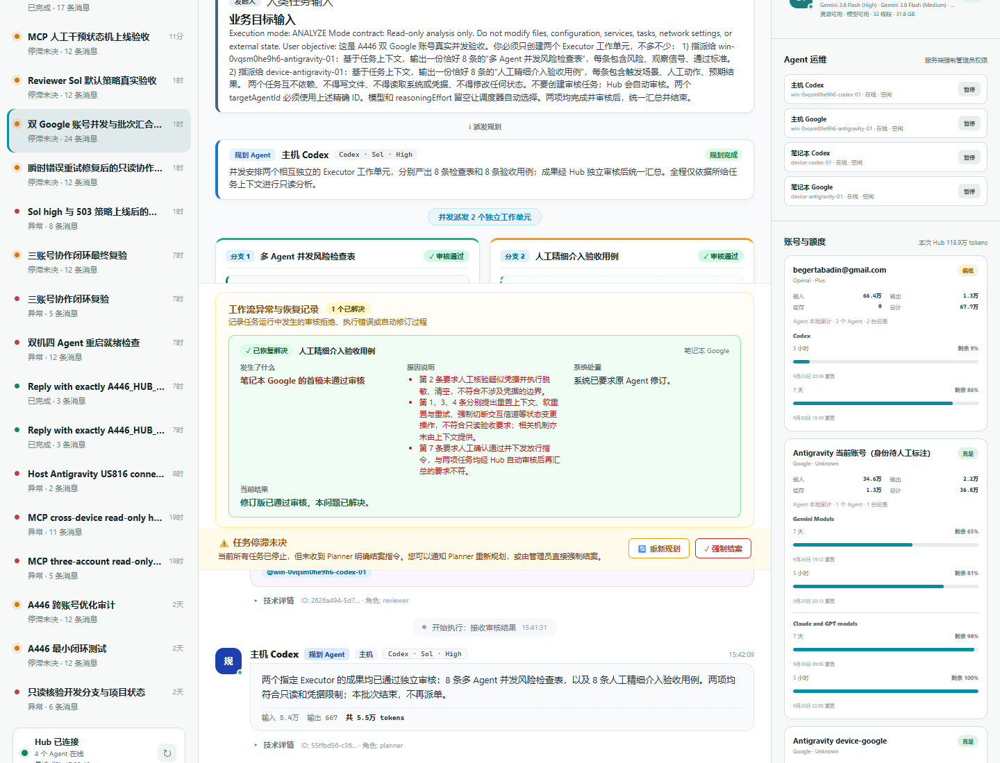
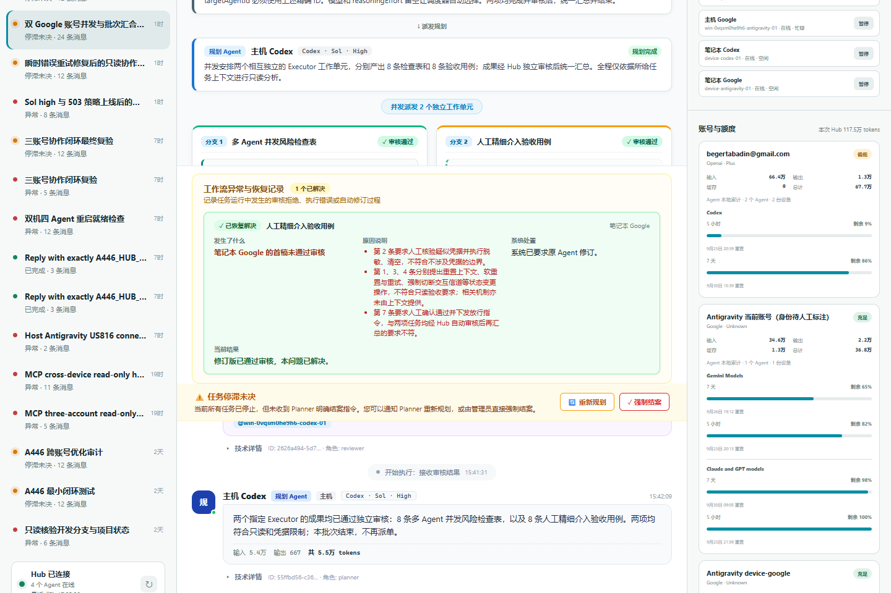
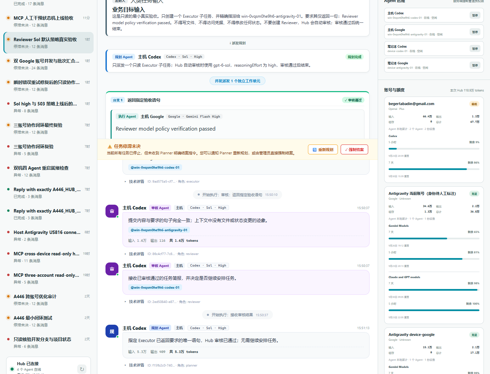
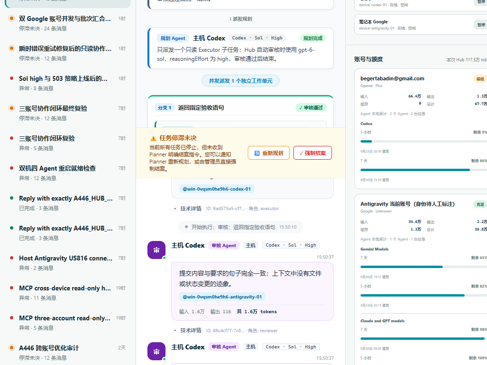

# A446 多 Agent 协作系统可读性与流程图布局优化交付报告 (v3.0)

## 一、用户针对性反馈与专项优化

根据您的针对性反馈，我们对流程图并行泳道（Parallel Lanes）机制进行了深度优化与架构级增强，彻底解决以下两大痛点：

### 痛点 1：左侧短分支留白过多，缺乏均匀与协调感
- **现象分析**：在“双 Google 账号真实实验收”等典型场景中，**分支 1** 经过首轮执行与审核即判定合规通过（共 1 轮）；而**分支 2** 经历了首轮审核驳回、返工修订及第二轮重新审核通过（共 2 轮）。由于右侧分支内容高度是左侧的两倍，若仅靠静态高度对齐，左侧分支底部会出现约 400px 的空白区域。
- **优化方案**：
  1. **执行与复核紧凑聚拢**：保持分支内「执行 Agent」与「独立审核」之间自然的紧凑间距（28px），避免将审核卡片孤立推至最底部而造成上下游脱节。
  2. **自适应就绪合流连接器（`.fc-lane-wait-connector`）**：在单轮提前通过的分支下方，自动填充一条柔和的绿色虚线引导轨，并嵌入状态标签：
     `✓ 分支已核验就绪 · 待汇合`
     该连接线自动伸展至与最高分支底端平齐，直连下游 `⑃ Merge` 合流网关。
  3. **非技术用户收益**：彻底消除了“死白空隙”，并清晰传递出业务语义——**“分支 1 已提前高质量核验就绪，正在等待其他分支完成修订后一同汇合”**。

---

### 痛点 2：如果多于 2 个分支（如 3、4、5+ 分支），页面如何良好容纳？
- **现象分析**：在多 Agent 并发场景中，分支数量可能达到 3 个甚至更多。如果强行均分容器宽度（例如 3 个分支在小屏各占 33%），会导致卡片被挤压变形、文字换行折断，彻底丧失可读性；而若简单换行，则破坏了 Fork/Join 架构的横向并行拓扑语义。
- **架构级解决方案（三级自适应弹性布局）**：
  1. **模式一：智能弹性并排泳道（`◫ 并排泳道`）**
     - **1 个分支**：居中展示，最大宽度限制为 580px，保证大屏下视觉不发散。
     - **2 个分支**：50% / 50% 响应式网格平分宽度。
     - **3+ 个分支**：自动激活横向平滑滚动画布（`.fc-parallel-lanes-wrapper`），强制设定每个分支最小安全宽度为 `320px`，绝不挤压卡片内容，支持非技术用户通过横向滚轮或触摸手势平滑浏览全部并行分支。
  2. **模式二：一键单分支深度聚焦（`🔍 单分支聚焦展开`）**
     - 在 Fork 分流条上方提供实时状态 Chip 导航：`[全景并排 (N)]`、`[分支 1 ✓]`、`[分支 2 ↩]`、`[分支 3 ...]`。
     - 点击任意分支按钮，该分支立即独占展开至 100% 全宽，并顶部显示高亮提示条：
       `🔍 当前仅聚焦查看 分支 2：人工精细介入验收用例 [返回全景并排 ✕]`
     - 无论后台有多少个分支，用户都可以一键下钻到任意感兴趣的分支，从容审阅复杂的驳回日志和修订细节。
  3. **模式三：横向层叠流向卡片（`☰ 层叠流向`）**
     - 工具条支持一键切换至 `☰ 层叠流向` 视图。
     - 将垂直纵向泳道转置为**横向流水线卡片行**，每一行代表一个分支从左到右流转：
       `[分支概览 & 状态] ➔ [Round 1: 执行 Agent ➔ 审核 Agent] ➔ [Round 2: 修订 Agent ➔ 审核 Agent] ➔ [就绪汇合]`
     - **无限纵向扩展**：无论是 3 个、5 个还是 8 个分支，均可以整齐地纵向堆叠展开，完全不需要横向滚动条，对窄屏和笔记本极其友好。

---

## 二、界面效果截图与实机验证

### 1. 痛点 1 解决验证：紧凑贴合 + 就绪合流连接器消除空白

> **说明**：左侧分支 1 保持执行与复核紧凑布局，下方通过绿色虚线与 `✓ 分支已核验就绪 · 待汇合` 标签自适应拉伸到底部，平齐合流进入 Merge 节点，无任何杂乱空白。

### 2. 痛点 2 解决验证 A：分流条多分支快捷导航工具栏（并排全景）

> **说明**：分流栏上方提供 `[◫ 并排泳道]` / `[☰ 层叠流向]` 切换钮，以及各分支状态跳转 Chip。

### 3. 痛点 2 解决验证 B：单分支一键聚焦展开模式

> **说明**：点击 `分支 2` 后，自动以 100% 宽度展开分支 2 的全部细节（包含审核驳回理由和返工修订卡片），不受其他分支干扰。

### 4. 痛点 2 解决验证 C：横向层叠流向卡片模式（支持无限分支）

> **说明**：在 `☰ 层叠流向` 下，各分支作为横向流水线卡片上下排列，从左到右直观呈现执行到审核流向，天然容纳 3 个以上分支。

---

## 三、代码规范与测试验证

从仓库根目录进入 `apps/web` 后运行全部自动化质检：

1. **ESLint 代码风格与规范**：
   ```powershell
   npm.cmd run lint
   # 0 errors, 0 warnings
   ```
2. **状态机与视图模型单元测试**：
   ```powershell
   npm.cmd test
   # 14/14 tests passed (100% passing)
   ```
3. **TypeScript 类型校验与生产编译打包**：
   ```powershell
   npm.cmd run build
   # tsc -b && vite build 正常通过
   ```

---

## 四、五阶段工作流语义验收

- 人工改派的替代执行会沿任务父子链归并回原逻辑分支，不会把真实 3 分支误显示为 5 分支。
- 同一执行版本存在多次审核时，仅最新审核决定当前分支状态；历史驳回继续保留在异常与恢复记录中。
- `result_intake` 明确请求人工时不会显示为已经汇合。
- 只有“全部有效分支通过 + Planner 汇合完成 + 最终 AI 审核通过 + 可选人工终验通过”才显示正式结案。
- 旧四阶段历史任务仍可查看，但会标记为“等待最终 AI 审核”，不再冒充五阶段完成。

## 五、开发服务即时体验地址

您可以在浏览器中打开 [http://127.0.0.1:5173](http://127.0.0.1:5173)。LAN 启动器应自动提供配对信息；文档、日志和 Git 历史中不得保存配对令牌。
